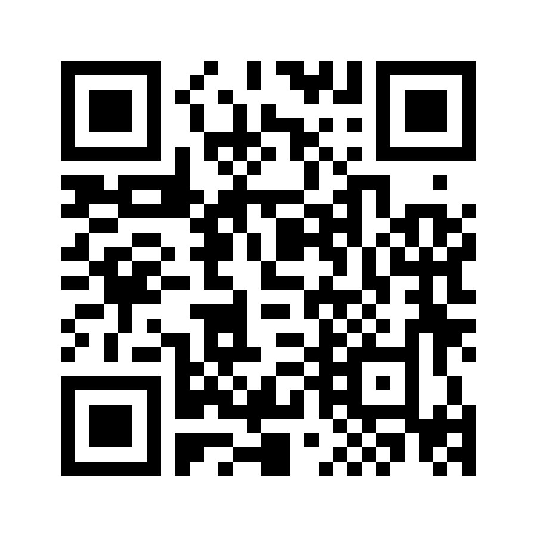
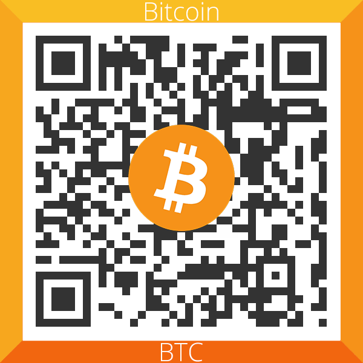
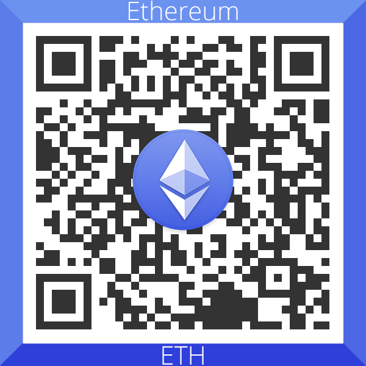
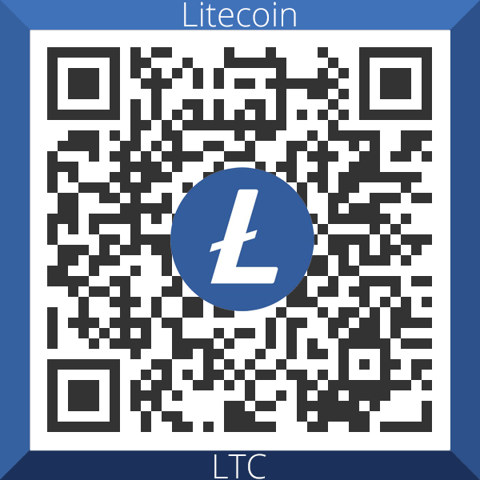
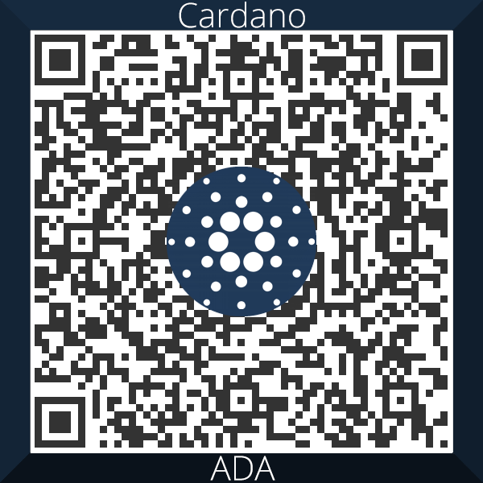
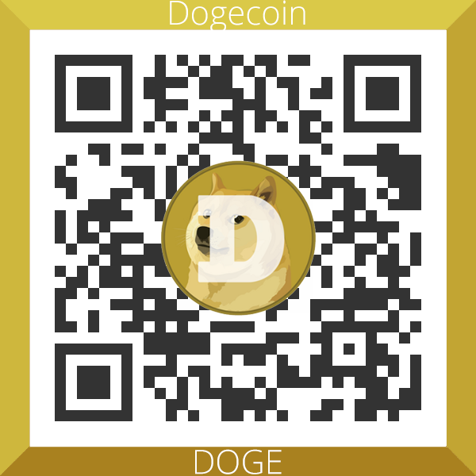

# 🎓🎓 SPŠE - Nematuritní předměty 🎓🎓

- ### Některé výpisky použité během mého studia na SPŠE Pardubice. 

 

### Máš nějaké další repozitáře s materiály do školy?
- Vyyřešené maturitní otázky: https://github.com/K-cermak/SPSE-Maturita.

 

### Jaký font používáš ve svých materiálech?
- V některých materiálech používám Montserrat, ke stažení [zde](https://fonts.google.com/specimen/Montserrat).

 

### Můžu ti přispět? ❤️❤️❤️

- Pokud ti mé materiály pomůžou a jsi ochoten ocenit moji snahu nějakou kačkou, můžeš tak učinit přes QR kódy níže:
    ### Účet: 2262692018/3030
     
    
    
    ### Crypto:
    - **BTC:** bc1qasgxc552wjqlpcm9vt7ucmw6p4zuz007dxh8n4  
     
    
     
     

    - **ETH:** 0x29Ca9054B2241aB39010a1434fb50e504EE10871
     
    
     
     

    - **LTC:** ltc1qxpgp3jc5jyem6096n48w48qqrwsrnj5eq9j890
     
    
     
     

    - **ADA:** addr1q8c89cet02nyql4ygj96s0cz5ntusgzxfzuykfngmaf0zt2ftj7wrayqm7dx52et7k7tkjjl2edan0wykww6q4twn79shzx8vn
     
    
     
     
    
    
    - **DOGE:** DCYFq9hPcVJkYKAgttkRXNSAkfbjEmLGdo
     
    
     
     

    ### A pokud jsi chudý student a všechny prachy prochlastáš, můžeš mi alespoň dát hvězdičku na GitHub repozitář…

    
© Karel Čermák 2023, see [license](LICENSE.md) for more details.